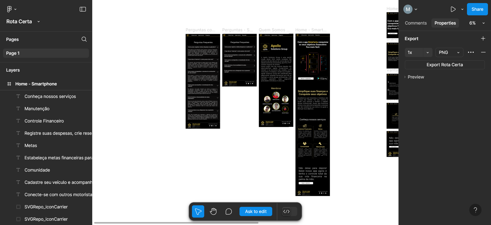
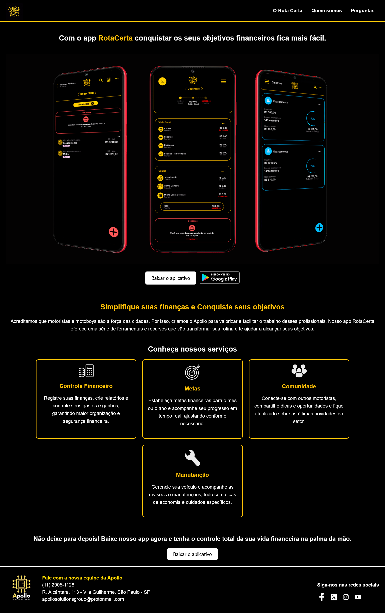

# Apollo Solutions Group

## Descrição

Apollo Solutions Group é uma equipe formada em 2024 por seis alunos do curso técnico de Desenvolvimento de Sistemas da ETEC Profº Horácio Augusto da Silveira. Nosso objetivo é oferecer soluções inovadoras para profissionais essenciais no trânsito e na economia urbana, como motoristas e motoboys. Nosso foco está em garantir mais segurança, praticidade e eficiência na rotina desses profissionais, por meio do desenvolvimento de aplicativos e sistemas eficientes.

## Funcionalidades

- Suporte e soluções para motoristas e motoboys.
- Desenvolvimento de aplicativos e sistemas voltados à melhoria da rotina desses profissionais.
- Interface amigável e fácil de usar.
- Design otimizado para dispositivos móveis.

## Tecnologias Utilizadas

- **Frontend**: HTML, CSS (com foco em responsividade)
- **Ferramentas de design**: Figma (para criação do layout e protótipos)

## Design

O design do projeto foi criado utilizando a ferramenta **Figma**. A seguir, apresentamos algumas imagens do protótipo que foram usadas como base para a construção do layout do site e funcionalidades.

### Design do Figma

*Prototipação do site*

## Screenshot do Site

Abaixo esta uma captura de tela do site Apollo Solutions Group, mostrando como ele se apresenta após a implementação.

*A página inicial com a navegação e introdução ao site.*

## Contribuições

Contribuições são bem-vindas! Se você quiser sugerir melhorias ou adicionar novas funcionalidades, fique à vontade para abrir uma issue ou fazer um pull request.

## Créditos

Desenvolvido por Mateus S. | Henrique Gonçalves  
GitHub: [Matz-Turing](https://github.com/Matz-Turing)  
GitHub: [HenriqueGoncalves22](https://github.com/HenriqueGoncalves22)

